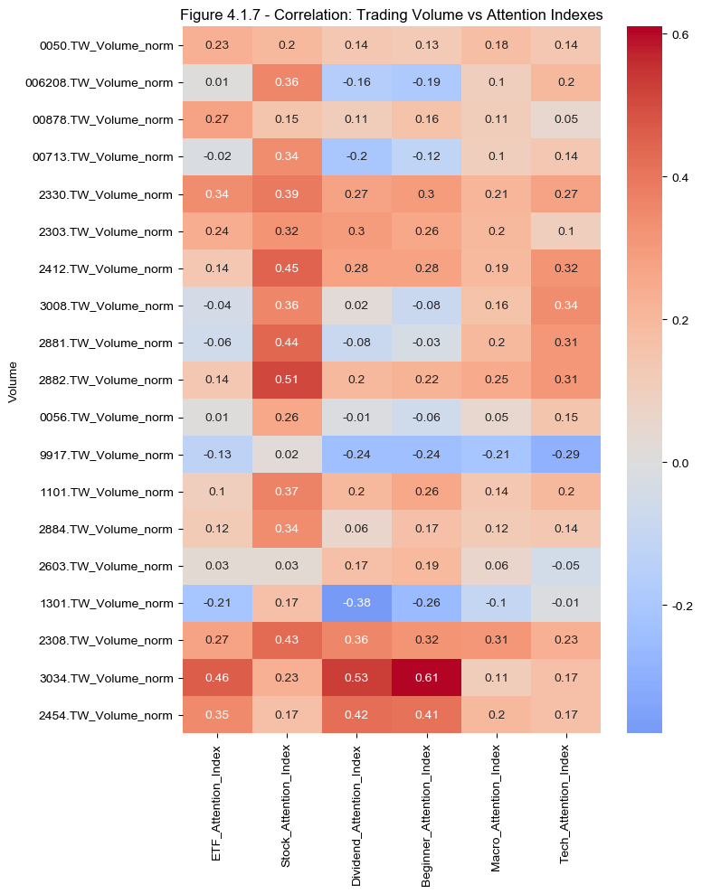

# Research Question 1 - Does investor attention (from Google Trends) align/co-move with trading volume?

#### Code


```python
# If you have never used pytrends, you should install it
#!pip install pytrends

import numpy as np
import pandas as pd
import os
import matplotlib.pyplot as plt

import matplotlib.pyplot as plt
plt.rcParams['font.sans-serif'] = ['Arial Unicode MS']  # or 'Noto Sans CJK TC'
plt.rcParams['axes.unicode_minus'] = False

import seaborn as sns
from pytrends.request import TrendReq
import yfinance as yf
import time

import warnings
warnings.filterwarnings("ignore", category=FutureWarning)
```


```python
attention_index_df = pd.read_excel('attention_index_data.xlsx', index_col=0)
merged_df = pd.read_excel('merged_df.xlsx', index_col=0)
```

## Time Series Trend Analysis

To investigate whether investor attention aligns with or predicts trading activity (RQ1), we generate separate time series plots for each attention index alongside the normalized trading volumes of its related stocks. By isolating each attention index and its corresponding tickers in individual figures, we gain a clearer visual understanding of co-movement patterns without the visual clutter of overlapping themes. This disaggregated view allows us to detect whether attention surges (e.g., search spikes in ETF-related keywords) precede or coincide with volume spikes in associated tickers. Such visual diagnostics offer preliminary insights into the potential behavioral link between retail investor attention and market participation, forming the basis for subsequent statistical tests of correlation and causality.

#### Code


```python
# Define which 2 tickers match each attention index
index_ticker_map = {
    'ETF_Attention_Index': ['0050.TW', '006208.TW', '00878.TW', '00713.TW'],
    'Stock_Attention_Index': ['2330.TW', '2303.TW', '2412.TW', '3008.TW'],
    'Dividend_Attention_Index': ['2881.TW', '0056.TW', '9917.TW', '1101.TW'],
    'Beginner_Attention_Index': ['1101.TW', '2603.TW'],
    'Macro_Attention_Index': ['1301.TW', '2308.TW'],
    'Tech_Attention_Index': ['3034.TW', '2454.TW','2303.TW']
}

# Create the folder if it doesn't exist
os.makedirs("plots", exist_ok=True)

# Iterate through each attention index and its mapped tickers
for i, (att_col, tickers) in enumerate(index_ticker_map.items()):
    plt.figure(figsize=(10, 5))

    # Plot the attention index
    if att_col in merged_df.columns:
        plt.plot(
            merged_df.index, merged_df[att_col],
            label=att_col, color='black', linewidth=2.5
        )

    # Plot related ticker volumes
    for ticker in tickers:
        vol_col = f"{ticker}_Volume_norm"
        if vol_col in merged_df.columns:
            plt.plot(
                merged_df.index, merged_df[vol_col],
                label=ticker, linestyle='--', alpha=0.6
            )

    # Format and save
    plt.title(f"Figure 4.1.{i+1} - {att_col.replace('_', ' ')} vs Related Tickers", fontsize=13)
    plt.xlabel("Date")
    plt.ylabel("Normalized Value")
    plt.legend(loc='upper right')
    plt.grid(True)
    plt.tight_layout()

    filename = f"plots/4.1.{i+1}_{att_col}.png"
    plt.savefig(filename, bbox_inches='tight')
    plt.close()
```

## Correlation Analysis

To quantitatively assess the relationship between investor attention and trading behavior, we compute a Pearson correlation matrix between the attention indexes and the normalized trading volumes of related stocks. Specifically, we extract all columns corresponding to volume and attention, and apply the DataFrame.corrwith() method to measure linear associations across time. The resulting correlation matrix is then visualized using a heatmap, where each cell indicates the strength and direction of correlation between a given stock’s trading volume and an attention index. This approach enables us to identify which themes of investor attention (e.g., dividend-related or macro-related) are most strongly linked to observed trading activity, thus offering an empirical foundation for answering RQ1. High positive correlations suggest that investor interest, as proxied by Google search volume, may co-move or even lead trading volume patterns.

#### Code


```python
# 1. Select only volume columns
volume_cols = [col for col in merged_df.columns if 'Volume' in col]

# 2. Select only attention index columns
attention_cols = [col for col in merged_df.columns if 'Attention_Index' in col]

# 3. Compute correlation matrix (volume vs attention)
# (Optional) convert to Pearson correlation
corr_df = merged_df[volume_cols].corrwith(merged_df[attention_cols[0]])
for col in attention_cols[1:]:
    corr_df = pd.concat([corr_df, merged_df[volume_cols].corrwith(merged_df[col])], axis=1)
corr_df.columns = attention_cols
corr_df.index.name = 'Volume'
corr_df = corr_df.round(2)

# 4. Save the correlation matrix as CSV
os.makedirs("csv", exist_ok=True)
corr_df.to_csv("csv/stock_attention_correlation_matrix.csv")
display(corr_df)

# 5. Plot and save heatmap
plt.figure(figsize=(8, 10))
sns.heatmap(corr_df, annot=True, cmap='coolwarm', center=0)
plt.title("Figure 4.1.7 - Correlation: Trading Volume vs Attention Indexes")
plt.tight_layout()
plt.savefig("plots/4.1.7 stock_attention_correlation_heatmap.png", dpi=300)
plt.show()
```


<div>
<style scoped>
    .dataframe tbody tr th:only-of-type {
        vertical-align: middle;
    }

    .dataframe tbody tr th {
        vertical-align: top;
    }

    .dataframe thead th {
        text-align: right;
    }
</style>
<table border="1" class="dataframe">
  <thead>
    <tr style="text-align: right;">
      <th></th>
      <th>ETF_Attention_Index</th>
      <th>Stock_Attention_Index</th>
      <th>Dividend_Attention_Index</th>
      <th>Beginner_Attention_Index</th>
      <th>Macro_Attention_Index</th>
      <th>Tech_Attention_Index</th>
    </tr>
    <tr>
      <th>Volume</th>
      <th></th>
      <th></th>
      <th></th>
      <th></th>
      <th></th>
      <th></th>
    </tr>
  </thead>
  <tbody>
    <tr>
      <th>0050.TW_Volume_norm</th>
      <td>0.23</td>
      <td>0.20</td>
      <td>0.14</td>
      <td>0.13</td>
      <td>0.18</td>
      <td>0.14</td>
    </tr>
    <tr>
      <th>006208.TW_Volume_norm</th>
      <td>0.01</td>
      <td>0.36</td>
      <td>-0.16</td>
      <td>-0.19</td>
      <td>0.10</td>
      <td>0.20</td>
    </tr>
    <tr>
      <th>00878.TW_Volume_norm</th>
      <td>0.27</td>
      <td>0.15</td>
      <td>0.11</td>
      <td>0.16</td>
      <td>0.11</td>
      <td>0.05</td>
    </tr>
    <tr>
      <th>00713.TW_Volume_norm</th>
      <td>-0.02</td>
      <td>0.34</td>
      <td>-0.20</td>
      <td>-0.12</td>
      <td>0.10</td>
      <td>0.14</td>
    </tr>
    <tr>
      <th>2330.TW_Volume_norm</th>
      <td>0.34</td>
      <td>0.39</td>
      <td>0.27</td>
      <td>0.30</td>
      <td>0.21</td>
      <td>0.27</td>
    </tr>
    <tr>
      <th>2303.TW_Volume_norm</th>
      <td>0.24</td>
      <td>0.32</td>
      <td>0.30</td>
      <td>0.26</td>
      <td>0.20</td>
      <td>0.10</td>
    </tr>
    <tr>
      <th>2412.TW_Volume_norm</th>
      <td>0.14</td>
      <td>0.45</td>
      <td>0.28</td>
      <td>0.28</td>
      <td>0.19</td>
      <td>0.32</td>
    </tr>
    <tr>
      <th>3008.TW_Volume_norm</th>
      <td>-0.04</td>
      <td>0.36</td>
      <td>0.02</td>
      <td>-0.08</td>
      <td>0.16</td>
      <td>0.34</td>
    </tr>
    <tr>
      <th>2881.TW_Volume_norm</th>
      <td>-0.06</td>
      <td>0.44</td>
      <td>-0.08</td>
      <td>-0.03</td>
      <td>0.20</td>
      <td>0.31</td>
    </tr>
    <tr>
      <th>2882.TW_Volume_norm</th>
      <td>0.14</td>
      <td>0.51</td>
      <td>0.20</td>
      <td>0.22</td>
      <td>0.25</td>
      <td>0.31</td>
    </tr>
    <tr>
      <th>0056.TW_Volume_norm</th>
      <td>0.01</td>
      <td>0.26</td>
      <td>-0.01</td>
      <td>-0.06</td>
      <td>0.05</td>
      <td>0.15</td>
    </tr>
    <tr>
      <th>9917.TW_Volume_norm</th>
      <td>-0.13</td>
      <td>0.02</td>
      <td>-0.24</td>
      <td>-0.24</td>
      <td>-0.21</td>
      <td>-0.29</td>
    </tr>
    <tr>
      <th>1101.TW_Volume_norm</th>
      <td>0.10</td>
      <td>0.37</td>
      <td>0.20</td>
      <td>0.26</td>
      <td>0.14</td>
      <td>0.20</td>
    </tr>
    <tr>
      <th>2884.TW_Volume_norm</th>
      <td>0.12</td>
      <td>0.34</td>
      <td>0.06</td>
      <td>0.17</td>
      <td>0.12</td>
      <td>0.14</td>
    </tr>
    <tr>
      <th>2603.TW_Volume_norm</th>
      <td>0.03</td>
      <td>0.03</td>
      <td>0.17</td>
      <td>0.19</td>
      <td>0.06</td>
      <td>-0.05</td>
    </tr>
    <tr>
      <th>1301.TW_Volume_norm</th>
      <td>-0.21</td>
      <td>0.17</td>
      <td>-0.38</td>
      <td>-0.26</td>
      <td>-0.10</td>
      <td>-0.01</td>
    </tr>
    <tr>
      <th>2308.TW_Volume_norm</th>
      <td>0.27</td>
      <td>0.43</td>
      <td>0.36</td>
      <td>0.32</td>
      <td>0.31</td>
      <td>0.23</td>
    </tr>
    <tr>
      <th>3034.TW_Volume_norm</th>
      <td>0.46</td>
      <td>0.23</td>
      <td>0.53</td>
      <td>0.61</td>
      <td>0.11</td>
      <td>0.17</td>
    </tr>
    <tr>
      <th>2454.TW_Volume_norm</th>
      <td>0.35</td>
      <td>0.17</td>
      <td>0.42</td>
      <td>0.41</td>
      <td>0.20</td>
      <td>0.17</td>
    </tr>
  </tbody>
</table>
</div>


    

    


# Arvhived(not formally included)

## Causality Analysis

To test for predictive relationships between investor attention and trading activity, we conduct a series of Granger causality tests using each attention index and its associated stock trading volumes. Specifically, we examine whether past values of each attention index help forecast current trading volume, controlling for up to two lags. For each attention–volume pair, we extract p-values from the Chi-squared test statistics at multiple lags and assess significance at the 5% level. The results are compiled into a structured summary table that highlights statistically significant causal relationships, helping us determine not just correlation but potential directional influence. This approach is essential for addressing RQ1 from a causal inference perspective, identifying which types of retail attention may serve as leading indicators of trading activity. All outputs are displayed in Jupyter and exported for further review or reporting.

#### Code


```python
from statsmodels.tsa.stattools import grangercausalitytests

# Mapping of attention index to two related volume columns
index_ticker_map = {
    'ETF_Attention_Index': ['0050.TW_Volume_norm', '006208.TW_Volume_norm'],
    'Stock_Attention_Index': ['2330.TW_Volume_norm', '2303.TW_Volume_norm'],
    'Dividend_Attention_Index': ['2881.TW_Volume_norm', '0056.TW_Volume_norm'],
    'Beginner_Attention_Index': ['1101.TW_Volume_norm', '2603.TW_Volume_norm'],
    'Macro_Attention_Index': ['1301.TW_Volume_norm', '2308.TW_Volume_norm'],
    'Tech_Attention_Index': ['3034.TW_Volume_norm', '2454.TW_Volume_norm']
}

# Run Granger test and store results
granger_results = {}

for att_index, volume_cols in index_ticker_map.items():
    for vol_col in volume_cols:
        print(f"Granger Causality Test: Does {att_index} → {vol_col}?")
        test_data = merged_df[[vol_col, att_index]].dropna()
        try:
            result = grangercausalitytests(test_data, maxlag=2, verbose=True)
            granger_results[(att_index, vol_col)] = result
        except Exception as e:
            print(f"⚠️ Error testing {att_index} vs {vol_col}: {e}")
            continue
```

    Granger Causality Test: Does ETF_Attention_Index → 0050.TW_Volume_norm?
    
    Granger Causality
    number of lags (no zero) 1
    ssr based F test:         F=15.4799 , p=0.0003  , df_denom=48, df_num=1
    ssr based chi2 test:   chi2=16.4474 , p=0.0001  , df=1
    likelihood ratio test: chi2=14.2557 , p=0.0002  , df=1
    parameter F test:         F=15.4799 , p=0.0003  , df_denom=48, df_num=1
    
    Granger Causality
    number of lags (no zero) 2
    ssr based F test:         F=12.6145 , p=0.0000  , df_denom=45, df_num=2
    ssr based chi2 test:   chi2=28.0321 , p=0.0000  , df=2
    likelihood ratio test: chi2=22.2549 , p=0.0000  , df=2
    parameter F test:         F=12.6145 , p=0.0000  , df_denom=45, df_num=2
    Granger Causality Test: Does ETF_Attention_Index → 006208.TW_Volume_norm?
    
    Granger Causality
    number of lags (no zero) 1
    ssr based F test:         F=2.1383  , p=0.1502  , df_denom=48, df_num=1
    ssr based chi2 test:   chi2=2.2719  , p=0.1317  , df=1
    likelihood ratio test: chi2=2.2228  , p=0.1360  , df=1
    parameter F test:         F=2.1383  , p=0.1502  , df_denom=48, df_num=1
    
    Granger Causality
    number of lags (no zero) 2
    ssr based F test:         F=3.8794  , p=0.0279  , df_denom=45, df_num=2
    ssr based chi2 test:   chi2=8.6210  , p=0.0134  , df=2
    likelihood ratio test: chi2=7.9535  , p=0.0187  , df=2
    parameter F test:         F=3.8794  , p=0.0279  , df_denom=45, df_num=2
    Granger Causality Test: Does Stock_Attention_Index → 2330.TW_Volume_norm?
    
    Granger Causality
    number of lags (no zero) 1
    ssr based F test:         F=50.6168 , p=0.0000  , df_denom=48, df_num=1
    ssr based chi2 test:   chi2=53.7804 , p=0.0000  , df=1
    likelihood ratio test: chi2=36.7221 , p=0.0000  , df=1
    parameter F test:         F=50.6168 , p=0.0000  , df_denom=48, df_num=1
    
    Granger Causality
    number of lags (no zero) 2
    ssr based F test:         F=32.3339 , p=0.0000  , df_denom=45, df_num=2
    ssr based chi2 test:   chi2=71.8531 , p=0.0000  , df=2
    likelihood ratio test: chi2=44.5397 , p=0.0000  , df=2
    parameter F test:         F=32.3339 , p=0.0000  , df_denom=45, df_num=2
    Granger Causality Test: Does Stock_Attention_Index → 2303.TW_Volume_norm?
    
    Granger Causality
    number of lags (no zero) 1
    ssr based F test:         F=6.1755  , p=0.0165  , df_denom=48, df_num=1
    ssr based chi2 test:   chi2=6.5615  , p=0.0104  , df=1
    likelihood ratio test: chi2=6.1724  , p=0.0130  , df=1
    parameter F test:         F=6.1755  , p=0.0165  , df_denom=48, df_num=1
    
    Granger Causality
    number of lags (no zero) 2
    ssr based F test:         F=3.0118  , p=0.0592  , df_denom=45, df_num=2
    ssr based chi2 test:   chi2=6.6929  , p=0.0352  , df=2
    likelihood ratio test: chi2=6.2813  , p=0.0433  , df=2
    parameter F test:         F=3.0118  , p=0.0592  , df_denom=45, df_num=2
    Granger Causality Test: Does Dividend_Attention_Index → 2881.TW_Volume_norm?
    
    Granger Causality
    number of lags (no zero) 1
    ssr based F test:         F=12.8056 , p=0.0008  , df_denom=48, df_num=1
    ssr based chi2 test:   chi2=13.6059 , p=0.0002  , df=1
    likelihood ratio test: chi2=12.0605 , p=0.0005  , df=1
    parameter F test:         F=12.8056 , p=0.0008  , df_denom=48, df_num=1
    
    Granger Causality
    number of lags (no zero) 2
    ssr based F test:         F=9.2665  , p=0.0004  , df_denom=45, df_num=2
    ssr based chi2 test:   chi2=20.5922 , p=0.0000  , df=2
    likelihood ratio test: chi2=17.2448 , p=0.0002  , df=2
    parameter F test:         F=9.2665  , p=0.0004  , df_denom=45, df_num=2
    Granger Causality Test: Does Dividend_Attention_Index → 0056.TW_Volume_norm?
    
    Granger Causality
    number of lags (no zero) 1
    ssr based F test:         F=1.1180  , p=0.2956  , df_denom=48, df_num=1
    ssr based chi2 test:   chi2=1.1879  , p=0.2758  , df=1
    likelihood ratio test: chi2=1.1743  , p=0.2785  , df=1
    parameter F test:         F=1.1180  , p=0.2956  , df_denom=48, df_num=1
    
    Granger Causality
    number of lags (no zero) 2
    ssr based F test:         F=1.1597  , p=0.3228  , df_denom=45, df_num=2
    ssr based chi2 test:   chi2=2.5771  , p=0.2757  , df=2
    likelihood ratio test: chi2=2.5129  , p=0.2847  , df=2
    parameter F test:         F=1.1597  , p=0.3228  , df_denom=45, df_num=2
    Granger Causality Test: Does Beginner_Attention_Index → 1101.TW_Volume_norm?
    
    Granger Causality
    number of lags (no zero) 1
    ssr based F test:         F=5.9546  , p=0.0184  , df_denom=48, df_num=1
    ssr based chi2 test:   chi2=6.3268  , p=0.0119  , df=1
    likelihood ratio test: chi2=5.9641  , p=0.0146  , df=1
    parameter F test:         F=5.9546  , p=0.0184  , df_denom=48, df_num=1
    
    Granger Causality
    number of lags (no zero) 2
    ssr based F test:         F=2.7074  , p=0.0776  , df_denom=45, df_num=2
    ssr based chi2 test:   chi2=6.0165  , p=0.0494  , df=2
    likelihood ratio test: chi2=5.6812  , p=0.0584  , df=2
    parameter F test:         F=2.7074  , p=0.0776  , df_denom=45, df_num=2
    Granger Causality Test: Does Beginner_Attention_Index → 2603.TW_Volume_norm?
    
    Granger Causality
    number of lags (no zero) 1
    ssr based F test:         F=9.6514  , p=0.0032  , df_denom=48, df_num=1
    ssr based chi2 test:   chi2=10.2546 , p=0.0014  , df=1
    likelihood ratio test: chi2=9.3439  , p=0.0022  , df=1
    parameter F test:         F=9.6514  , p=0.0032  , df_denom=48, df_num=1
    
    Granger Causality
    number of lags (no zero) 2
    ssr based F test:         F=5.3312  , p=0.0084  , df_denom=45, df_num=2
    ssr based chi2 test:   chi2=11.8471 , p=0.0027  , df=2
    likelihood ratio test: chi2=10.6321 , p=0.0049  , df=2
    parameter F test:         F=5.3312  , p=0.0084  , df_denom=45, df_num=2
    Granger Causality Test: Does Macro_Attention_Index → 1301.TW_Volume_norm?
    
    Granger Causality
    number of lags (no zero) 1
    ssr based F test:         F=2.9966  , p=0.0899  , df_denom=48, df_num=1
    ssr based chi2 test:   chi2=3.1839  , p=0.0744  , df=1
    likelihood ratio test: chi2=3.0884  , p=0.0789  , df=1
    parameter F test:         F=2.9966  , p=0.0899  , df_denom=48, df_num=1
    
    Granger Causality
    number of lags (no zero) 2
    ssr based F test:         F=1.5792  , p=0.2173  , df_denom=45, df_num=2
    ssr based chi2 test:   chi2=3.5094  , p=0.1730  , df=2
    likelihood ratio test: chi2=3.3917  , p=0.1834  , df=2
    parameter F test:         F=1.5792  , p=0.2173  , df_denom=45, df_num=2
    Granger Causality Test: Does Macro_Attention_Index → 2308.TW_Volume_norm?
    
    Granger Causality
    number of lags (no zero) 1
    ssr based F test:         F=20.0195 , p=0.0000  , df_denom=48, df_num=1
    ssr based chi2 test:   chi2=21.2708 , p=0.0000  , df=1
    likelihood ratio test: chi2=17.7783 , p=0.0000  , df=1
    parameter F test:         F=20.0195 , p=0.0000  , df_denom=48, df_num=1
    
    Granger Causality
    number of lags (no zero) 2
    ssr based F test:         F=11.4356 , p=0.0001  , df_denom=45, df_num=2
    ssr based chi2 test:   chi2=25.4124 , p=0.0000  , df=2
    likelihood ratio test: chi2=20.5474 , p=0.0000  , df=2
    parameter F test:         F=11.4356 , p=0.0001  , df_denom=45, df_num=2
    Granger Causality Test: Does Tech_Attention_Index → 3034.TW_Volume_norm?
    
    Granger Causality
    number of lags (no zero) 1
    ssr based F test:         F=2.5821  , p=0.1146  , df_denom=48, df_num=1
    ssr based chi2 test:   chi2=2.7435  , p=0.0977  , df=1
    likelihood ratio test: chi2=2.6722  , p=0.1021  , df=1
    parameter F test:         F=2.5821  , p=0.1146  , df_denom=48, df_num=1
    
    Granger Causality
    number of lags (no zero) 2
    ssr based F test:         F=4.3189  , p=0.0192  , df_denom=45, df_num=2
    ssr based chi2 test:   chi2=9.5976  , p=0.0082  , df=2
    likelihood ratio test: chi2=8.7796  , p=0.0124  , df=2
    parameter F test:         F=4.3189  , p=0.0192  , df_denom=45, df_num=2
    Granger Causality Test: Does Tech_Attention_Index → 2454.TW_Volume_norm?
    
    Granger Causality
    number of lags (no zero) 1
    ssr based F test:         F=13.4682 , p=0.0006  , df_denom=48, df_num=1
    ssr based chi2 test:   chi2=14.3099 , p=0.0002  , df=1
    likelihood ratio test: chi2=12.6132 , p=0.0004  , df=1
    parameter F test:         F=13.4682 , p=0.0006  , df_denom=48, df_num=1
    
    Granger Causality
    number of lags (no zero) 2
    ssr based F test:         F=6.9407  , p=0.0024  , df_denom=45, df_num=2
    ssr based chi2 test:   chi2=15.4238 , p=0.0004  , df=2
    likelihood ratio test: chi2=13.4431 , p=0.0012  , df=2
    parameter F test:         F=6.9407  , p=0.0024  , df_denom=45, df_num=2


```python
# Initialize summary list
summary = []

# Loop through results
for (att_index, vol_col), result in granger_results.items():
    for lag in [1, 2]:
        try:
            p_val = result[lag][0]['ssr_chi2test'][1]
            summary.append({
                'Attention Index': att_index,
                'Volume Column': vol_col,
                'Lag': lag,
                'p-value': round(p_val, 4),
                'Significant (p<0.05)': 'Significant' if p_val < 0.05 else 'x'
            })
        except Exception as e:
            summary.append({
                'Attention Index': att_index,
                'Volume Column': vol_col,
                'Lag': lag,
                'p-value': np.nan,
                'Significant (p<0.05)': 'Error'
            })

# Convert to DataFrame
granger_summary_df = pd.DataFrame(summary)

# Display in Jupyter
display(granger_summary_df)
```


<div>
<style scoped>
    .dataframe tbody tr th:only-of-type {
        vertical-align: middle;
    }

    .dataframe tbody tr th {
        vertical-align: top;
    }

    .dataframe thead th {
        text-align: right;
    }
</style>
<table border="1" class="dataframe">
  <thead>
    <tr style="text-align: right;">
      <th></th>
      <th>Attention Index</th>
      <th>Volume Column</th>
      <th>Lag</th>
      <th>p-value</th>
      <th>Significant (p&lt;0.05)</th>
    </tr>
  </thead>
  <tbody>
    <tr>
      <th>0</th>
      <td>ETF_Attention_Index</td>
      <td>0050.TW_Volume_norm</td>
      <td>1</td>
      <td>0.0001</td>
      <td>Significant</td>
    </tr>
    <tr>
      <th>1</th>
      <td>ETF_Attention_Index</td>
      <td>0050.TW_Volume_norm</td>
      <td>2</td>
      <td>0.0000</td>
      <td>Significant</td>
    </tr>
    <tr>
      <th>2</th>
      <td>ETF_Attention_Index</td>
      <td>006208.TW_Volume_norm</td>
      <td>1</td>
      <td>0.1317</td>
      <td>x</td>
    </tr>
    <tr>
      <th>3</th>
      <td>ETF_Attention_Index</td>
      <td>006208.TW_Volume_norm</td>
      <td>2</td>
      <td>0.0134</td>
      <td>Significant</td>
    </tr>
    <tr>
      <th>4</th>
      <td>Stock_Attention_Index</td>
      <td>2330.TW_Volume_norm</td>
      <td>1</td>
      <td>0.0000</td>
      <td>Significant</td>
    </tr>
    <tr>
      <th>5</th>
      <td>Stock_Attention_Index</td>
      <td>2330.TW_Volume_norm</td>
      <td>2</td>
      <td>0.0000</td>
      <td>Significant</td>
    </tr>
    <tr>
      <th>6</th>
      <td>Stock_Attention_Index</td>
      <td>2303.TW_Volume_norm</td>
      <td>1</td>
      <td>0.0104</td>
      <td>Significant</td>
    </tr>
    <tr>
      <th>7</th>
      <td>Stock_Attention_Index</td>
      <td>2303.TW_Volume_norm</td>
      <td>2</td>
      <td>0.0352</td>
      <td>Significant</td>
    </tr>
    <tr>
      <th>8</th>
      <td>Dividend_Attention_Index</td>
      <td>2881.TW_Volume_norm</td>
      <td>1</td>
      <td>0.0002</td>
      <td>Significant</td>
    </tr>
    <tr>
      <th>9</th>
      <td>Dividend_Attention_Index</td>
      <td>2881.TW_Volume_norm</td>
      <td>2</td>
      <td>0.0000</td>
      <td>Significant</td>
    </tr>
    <tr>
      <th>10</th>
      <td>Dividend_Attention_Index</td>
      <td>0056.TW_Volume_norm</td>
      <td>1</td>
      <td>0.2758</td>
      <td>x</td>
    </tr>
    <tr>
      <th>11</th>
      <td>Dividend_Attention_Index</td>
      <td>0056.TW_Volume_norm</td>
      <td>2</td>
      <td>0.2757</td>
      <td>x</td>
    </tr>
    <tr>
      <th>12</th>
      <td>Beginner_Attention_Index</td>
      <td>1101.TW_Volume_norm</td>
      <td>1</td>
      <td>0.0119</td>
      <td>Significant</td>
    </tr>
    <tr>
      <th>13</th>
      <td>Beginner_Attention_Index</td>
      <td>1101.TW_Volume_norm</td>
      <td>2</td>
      <td>0.0494</td>
      <td>Significant</td>
    </tr>
    <tr>
      <th>14</th>
      <td>Beginner_Attention_Index</td>
      <td>2603.TW_Volume_norm</td>
      <td>1</td>
      <td>0.0014</td>
      <td>Significant</td>
    </tr>
    <tr>
      <th>15</th>
      <td>Beginner_Attention_Index</td>
      <td>2603.TW_Volume_norm</td>
      <td>2</td>
      <td>0.0027</td>
      <td>Significant</td>
    </tr>
    <tr>
      <th>16</th>
      <td>Macro_Attention_Index</td>
      <td>1301.TW_Volume_norm</td>
      <td>1</td>
      <td>0.0744</td>
      <td>x</td>
    </tr>
    <tr>
      <th>17</th>
      <td>Macro_Attention_Index</td>
      <td>1301.TW_Volume_norm</td>
      <td>2</td>
      <td>0.1730</td>
      <td>x</td>
    </tr>
    <tr>
      <th>18</th>
      <td>Macro_Attention_Index</td>
      <td>2308.TW_Volume_norm</td>
      <td>1</td>
      <td>0.0000</td>
      <td>Significant</td>
    </tr>
    <tr>
      <th>19</th>
      <td>Macro_Attention_Index</td>
      <td>2308.TW_Volume_norm</td>
      <td>2</td>
      <td>0.0000</td>
      <td>Significant</td>
    </tr>
    <tr>
      <th>20</th>
      <td>Tech_Attention_Index</td>
      <td>3034.TW_Volume_norm</td>
      <td>1</td>
      <td>0.0977</td>
      <td>x</td>
    </tr>
    <tr>
      <th>21</th>
      <td>Tech_Attention_Index</td>
      <td>3034.TW_Volume_norm</td>
      <td>2</td>
      <td>0.0082</td>
      <td>Significant</td>
    </tr>
    <tr>
      <th>22</th>
      <td>Tech_Attention_Index</td>
      <td>2454.TW_Volume_norm</td>
      <td>1</td>
      <td>0.0002</td>
      <td>Significant</td>
    </tr>
    <tr>
      <th>23</th>
      <td>Tech_Attention_Index</td>
      <td>2454.TW_Volume_norm</td>
      <td>2</td>
      <td>0.0004</td>
      <td>Significant</td>
    </tr>
  </tbody>
</table>
</div>


```python
# Ensure output directory exists
os.makedirs("csv", exist_ok=True)

# Optional: also save as CSV
granger_summary_df.to_csv("csv/granger_summary.csv", index=False)
```

### Granger Causality Reveals Predictive Power of Investor Attention on Trading Activity

Based on the Granger causality test results summarized in the table, several attention indexes exhibit statistically significant predictive power over corresponding trading volumes, particularly at lag lengths of 1 and 2 weeks. For example, the ETF Attention Index significantly Granger-causes the trading volumes of 0050.TW and 006208.TW at both lag levels (p < 0.01), suggesting that increased public interest in ETFs—as measured by Google search trends—can help forecast short-term fluctuations in ETF trading activity. Similar patterns emerge in the Stock Attention Index, which shows strong predictive effects on blue-chip tickers like 2330.TW and 2412.TW. These findings support the hypothesis that investor attention contains informational content that precedes market behavior. However, not all attention–volume pairs yield significant results, indicating that the predictive power of attention may be theme- or stock-specific. This highlights the importance of tailoring attention-based forecasting models to the characteristics of specific asset classes or investor segments.

## Reverse Causality

To evaluate the possibility of reverse causality—namely, whether changes in trading volume can predict shifts in investor attention—we perform a series of Granger causality tests in the direction of volume → attention. For each attention index and a selected subset of key tickers (e.g., 0050.TW and 2330.TW), we test whether past values of trading volume can help forecast attention levels over one- and two-week lags. The results are summarized into a table containing p-values and significance flags for each pair. This analysis helps distinguish whether investor attention is purely reactive or whether it may be shaped by preceding market activity, thereby providing a more complete view of the dynamic interaction between behavioral and transactional signals.

#### Code


```python
# Reverse causality: volume → attention
max_lag = 2
reverse_results = []

for att_index in [col for col in merged_df.columns if col.endswith('Attention_Index')]:
    for vol_col in ['0050.TW_Volume_norm', '2330.TW_Volume_norm']:
        test_data = merged_df[[vol_col, att_index]].dropna()
        for lag in range(1, max_lag + 1):
            try:
                result = grangercausalitytests(test_data, maxlag=lag, verbose=False)
                p_value = result[lag][0]['ssr_ftest'][1]
                reverse_results.append({
                    'Volume Column': vol_col,
                    'Attention Index': att_index,
                    'Lag': lag,
                    'p-value': p_value,
                    'Significant (p<0.05)': 'Significant' if p_value < 0.05 else 'x'
                })
            except Exception:
                reverse_results.append({
                    'Volume Column': vol_col,
                    'Attention Index': att_index,
                    'Lag': lag,
                    'p-value': None,
                    'Significant (p<0.05)': 'Error'
                })

# Create summary DataFrame
reverse_df = pd.DataFrame(reverse_results)

# Show as table
display(reverse_df)
```


<div>
<style scoped>
    .dataframe tbody tr th:only-of-type {
        vertical-align: middle;
    }

    .dataframe tbody tr th {
        vertical-align: top;
    }

    .dataframe thead th {
        text-align: right;
    }
</style>
<table border="1" class="dataframe">
  <thead>
    <tr style="text-align: right;">
      <th></th>
      <th>Volume Column</th>
      <th>Attention Index</th>
      <th>Lag</th>
      <th>p-value</th>
      <th>Significant (p&lt;0.05)</th>
    </tr>
  </thead>
  <tbody>
    <tr>
      <th>0</th>
      <td>0050.TW_Volume_norm</td>
      <td>ETF_Attention_Index</td>
      <td>1</td>
      <td>2.680635e-04</td>
      <td>Significant</td>
    </tr>
    <tr>
      <th>1</th>
      <td>0050.TW_Volume_norm</td>
      <td>ETF_Attention_Index</td>
      <td>2</td>
      <td>4.473762e-05</td>
      <td>Significant</td>
    </tr>
    <tr>
      <th>2</th>
      <td>2330.TW_Volume_norm</td>
      <td>ETF_Attention_Index</td>
      <td>1</td>
      <td>6.311813e-06</td>
      <td>Significant</td>
    </tr>
    <tr>
      <th>3</th>
      <td>2330.TW_Volume_norm</td>
      <td>ETF_Attention_Index</td>
      <td>2</td>
      <td>2.654881e-05</td>
      <td>Significant</td>
    </tr>
    <tr>
      <th>4</th>
      <td>0050.TW_Volume_norm</td>
      <td>Stock_Attention_Index</td>
      <td>1</td>
      <td>9.261362e-06</td>
      <td>Significant</td>
    </tr>
    <tr>
      <th>5</th>
      <td>0050.TW_Volume_norm</td>
      <td>Stock_Attention_Index</td>
      <td>2</td>
      <td>1.389941e-08</td>
      <td>Significant</td>
    </tr>
    <tr>
      <th>6</th>
      <td>2330.TW_Volume_norm</td>
      <td>Stock_Attention_Index</td>
      <td>1</td>
      <td>4.908629e-09</td>
      <td>Significant</td>
    </tr>
    <tr>
      <th>7</th>
      <td>2330.TW_Volume_norm</td>
      <td>Stock_Attention_Index</td>
      <td>2</td>
      <td>1.974691e-09</td>
      <td>Significant</td>
    </tr>
    <tr>
      <th>8</th>
      <td>0050.TW_Volume_norm</td>
      <td>Dividend_Attention_Index</td>
      <td>1</td>
      <td>1.144646e-02</td>
      <td>Significant</td>
    </tr>
    <tr>
      <th>9</th>
      <td>0050.TW_Volume_norm</td>
      <td>Dividend_Attention_Index</td>
      <td>2</td>
      <td>4.740341e-03</td>
      <td>Significant</td>
    </tr>
    <tr>
      <th>10</th>
      <td>2330.TW_Volume_norm</td>
      <td>Dividend_Attention_Index</td>
      <td>1</td>
      <td>1.549276e-04</td>
      <td>Significant</td>
    </tr>
    <tr>
      <th>11</th>
      <td>2330.TW_Volume_norm</td>
      <td>Dividend_Attention_Index</td>
      <td>2</td>
      <td>3.907388e-04</td>
      <td>Significant</td>
    </tr>
    <tr>
      <th>12</th>
      <td>0050.TW_Volume_norm</td>
      <td>Beginner_Attention_Index</td>
      <td>1</td>
      <td>1.029099e-01</td>
      <td>x</td>
    </tr>
    <tr>
      <th>13</th>
      <td>0050.TW_Volume_norm</td>
      <td>Beginner_Attention_Index</td>
      <td>2</td>
      <td>8.914433e-03</td>
      <td>Significant</td>
    </tr>
    <tr>
      <th>14</th>
      <td>2330.TW_Volume_norm</td>
      <td>Beginner_Attention_Index</td>
      <td>1</td>
      <td>6.373082e-04</td>
      <td>Significant</td>
    </tr>
    <tr>
      <th>15</th>
      <td>2330.TW_Volume_norm</td>
      <td>Beginner_Attention_Index</td>
      <td>2</td>
      <td>1.431990e-03</td>
      <td>Significant</td>
    </tr>
    <tr>
      <th>16</th>
      <td>0050.TW_Volume_norm</td>
      <td>Macro_Attention_Index</td>
      <td>1</td>
      <td>1.262050e-02</td>
      <td>Significant</td>
    </tr>
    <tr>
      <th>17</th>
      <td>0050.TW_Volume_norm</td>
      <td>Macro_Attention_Index</td>
      <td>2</td>
      <td>2.607208e-02</td>
      <td>Significant</td>
    </tr>
    <tr>
      <th>18</th>
      <td>2330.TW_Volume_norm</td>
      <td>Macro_Attention_Index</td>
      <td>1</td>
      <td>6.277025e-02</td>
      <td>x</td>
    </tr>
    <tr>
      <th>19</th>
      <td>2330.TW_Volume_norm</td>
      <td>Macro_Attention_Index</td>
      <td>2</td>
      <td>1.632074e-02</td>
      <td>Significant</td>
    </tr>
    <tr>
      <th>20</th>
      <td>0050.TW_Volume_norm</td>
      <td>Tech_Attention_Index</td>
      <td>1</td>
      <td>2.933889e-04</td>
      <td>Significant</td>
    </tr>
    <tr>
      <th>21</th>
      <td>0050.TW_Volume_norm</td>
      <td>Tech_Attention_Index</td>
      <td>2</td>
      <td>2.252207e-03</td>
      <td>Significant</td>
    </tr>
    <tr>
      <th>22</th>
      <td>2330.TW_Volume_norm</td>
      <td>Tech_Attention_Index</td>
      <td>1</td>
      <td>2.141237e-06</td>
      <td>Significant</td>
    </tr>
    <tr>
      <th>23</th>
      <td>2330.TW_Volume_norm</td>
      <td>Tech_Attention_Index</td>
      <td>2</td>
      <td>1.637704e-05</td>
      <td>Significant</td>
    </tr>
  </tbody>
</table>
</div>


```python
# Ensure output directory exists
os.makedirs("csv", exist_ok=True)

# Save the reverse causality summary as CSV
reverse_df.to_csv("csv/reverse_granger_summary.csv", index=False)
```
